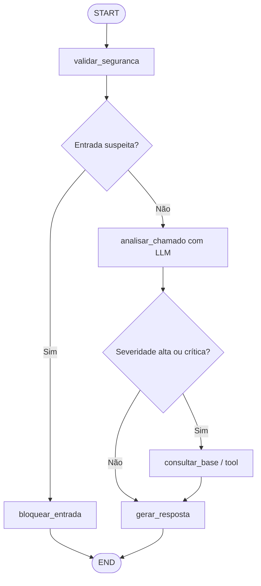

# Agente de Triagem de Chamados Técnicos

[](https://github.com/eliandrolima/agente-triagem-chamados/actions/workflows/ci.yml)

Projeto avaliativo de recuperação do curso **IA para Desenvolvedores - SCTEC**.

Repositório: https://github.com/eliandrolima/agente-triagem-chamados

## Sobre o projeto

A aplicação recebe chamados de software, infraestrutura ou suporte, analisa o conteúdo
com Gemini ou GPT e devolve uma triagem estruturada. O fluxo usa LangGraph para tornar
as decisões, a consulta de contexto e a condição de parada explícitas e demonstráveis.

A solução foi intencionalmente mantida pequena: uma API FastAPI, uma interface em HTML,
CSS e JavaScript e uma base local de procedimentos em JSON.

## Funcionalidades

- entrada validada com título, descrição, serviço e ambiente;
- classificação por categoria e severidade com saída estruturada do LLM;
- roteamento condicional com LangGraph;
- consulta de runbook por uma tool funcional;
- uso do runbook recuperado na ação sugerida;
- indicação de necessidade de revisão humana;
- bloqueio de padrões explícitos de prompt injection;
- logs JSON correlacionados por identificador de execução;
- tratamento de entrada inválida, configuração ausente e falha da tool;
- interface web responsiva;
- testes automatizados e pipeline de CI.

## Arquitetura



O frontend chama `POST /api/tickets/triage`. A API inicia o grafo, que mantém o estado
compartilhado até produzir o contrato final `TriagemResposta`.

### State do LangGraph

O `TriagemState` contém:

| Campo | Finalidade |
| --- | --- |
| `chamado` | Entrada validada recebida pela API. |
| `execution_id` | Correlação dos logs da execução. |
| `injection_detectada` | Resultado da validação de segurança. |
| `analise` | Categoria, severidade, resumo e justificativa produzidos pelo LLM. |
| `contexto` | Runbook recuperado pela tool. |
| `fontes_contexto` | Origem do conteúdo utilizado na resposta. |
| `erro_tool` | Falha controlada durante a consulta. |
| `rota` | Caminho final percorrido. |
| `resposta` | Saída estruturada apresentada ao usuário. |

### Nodes e decisões

- `validar_seguranca`: verifica padrões adversariais antes de acessar o LLM.
- `bloquear_entrada`: encerra de forma segura uma entrada suspeita.
- `analisar_chamado`: usa o modelo para gerar `AnaliseLLM` estruturada.
- `consultar_base`: chama a tool de runbooks quando a severidade é alta ou crítica.
- `gerar_resposta`: combina análise e contexto em `TriagemResposta`.

As decisões de segurança e roteamento são determinísticas. O LLM é responsável pela
análise sem controlar diretamente as edges. O grafo não contém loops e termina em `END`.

## Tool e estratégia de contexto

A tool `consultar_runbook` recebe uma categoria validada e consulta
`data/runbooks.json`. A saída possui título e passos recomendados. Quando o chamado é
grave, esses passos entram efetivamente em `acao_sugerida`, e a fonte é informada em
`fontes_contexto`.

Categoria ausente ou arquivo inválido geram uma falha controlada. Nesse caso, a resposta
usa a rota `fallback_tool` e solicita revisão humana.

## Provedores de LLM

O provedor é escolhido somente por variáveis de ambiente:

| Provedor | `LLM_PROVIDER` | Variável da chave |
| --- | --- | --- |
| Gemini | `google` | `GOOGLE_API_KEY` |
| OpenAI | `openai` | `OPENAI_API_KEY` |

O exemplo usa o modelo estável `gemini-2.5-flash`. Outro modelo compatível pode ser
informado em `LLM_MODEL` sem alterar o código.

## Instalação

Requisitos: Python 3.11 ou superior e uma chave de um dos provedores.

No PowerShell:

```powershell
python -m venv .venv
.\.venv\Scripts\Activate.ps1
python -m pip install -e ".[dev]"
Copy-Item .env.example .env
```

Edite somente o arquivo `.env` criado e preencha a chave do provedor escolhido. O arquivo
é ignorado pelo Git e nunca deve ser enviado ao repositório.

## Execução

```powershell
uvicorn triagem.api:app --reload
```

Abra `http://127.0.0.1:8000`.

- health check: `http://127.0.0.1:8000/api/health`;
- documentação da API: `http://127.0.0.1:8000/docs`.

## Cenários de demonstração

### Fluxo principal

Use o botão **Usar exemplo** ou os dados em `data/exemplos.json`. O chamado de produção
é classificado, roteado para a tool, enriquecido com o runbook e devolvido com revisão
humana.

### Falha ou entrada inválida

Envie título `Erro` e descrição `Falhou`. A API responde HTTP 422 sem acessar o LLM.
Também é possível executar sem `LLM_MODEL` para observar uma resposta HTTP 503
controlada.

### Cenário adversarial

O exemplo de prompt injection em `data/exemplos.json` é bloqueado antes da criação do
cliente externo. A saída usa `entrada_bloqueada` e exige revisão humana.

## Testes e qualidade

```powershell
pytest -q
ruff check .
```

Os testes usam um analisador falso e não consomem API. Eles cobrem:

- health check e carregamento da interface;
- saída estruturada da API;
- entrada inválida e configuração ausente;
- caminhos direto, com tool e adversarial do grafo;
- sucesso e falha da tool.

O workflow `.github/workflows/ci.yml` executa lint e testes em pushes para `main` e em
pull requests.

## Extensões técnicas

### 1. Pipeline de CI

O GitHub Actions instala o projeto e executa Ruff e pytest. A execução publicada no
GitHub será a evidência desta extensão.

### 2. Proteção contra prompt injection

O node de segurança aplica regras simples antes do LLM. Uma entrada suspeita não é
executada como instrução, não acessa chaves e termina com revisão humana. O cenário está
coberto por testes e pode ser reproduzido pela interface.

## Evidências de desenvolvimento

- [Revisão de QA com IA](docs/ai-qa-review.md)
- [Refinamento de comportamento](docs/behavior-refinement.md)
- [Execução do pipeline de CI](docs/evidencias/ci.md)
- evidências visuais finais serão armazenadas em `docs/evidencias/`.

## Observabilidade

Cada execução gera logs em JSON contendo, conforme o caminho percorrido:

- `execution_id`;
- node executado;
- decisão e destino do roteamento;
- nome e parâmetros da tool;
- erro tratado.

Isso permite reconstruir o caminho sem adicionar uma plataforma externa.

## Limitações

- a base de conhecimento é pequena e local;
- a detecção adversarial usa padrões explícitos e não cobre todas as variações possíveis;
- a classificação depende da qualidade e disponibilidade do provedor externo;
- não há autenticação ou persistência, pois são desnecessárias para o escopo acadêmico;
- os procedimentos são exemplos e não substituem runbooks operacionais reais.

## Vídeo de demonstração

Link do vídeo não listado no YouTube: **adicionar antes da entrega**.
